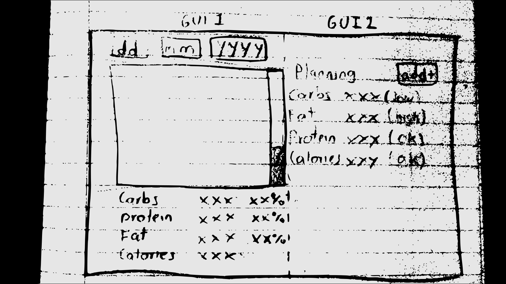
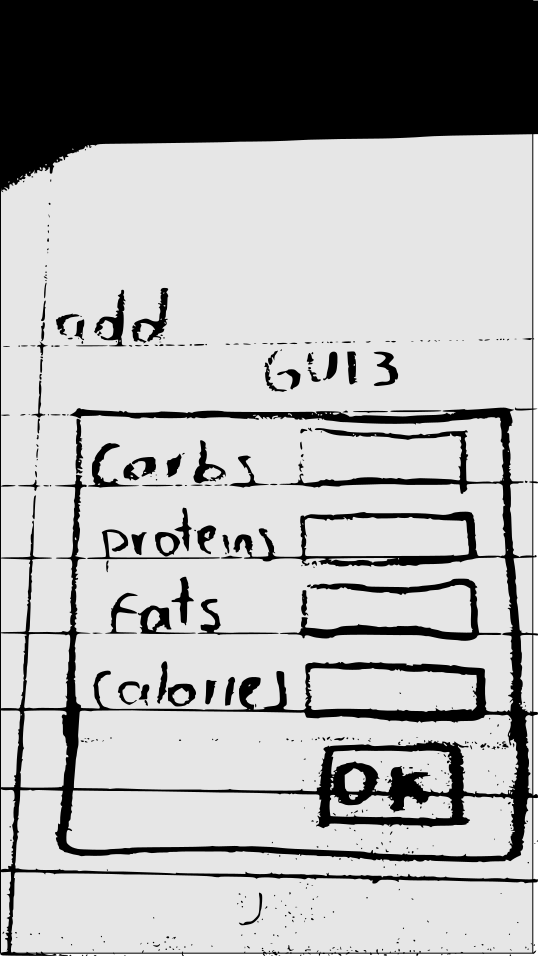

# keto planner

take account of food ingest and calculate statistics for keto planning tracking

## get started

run ```python3 tests.py```

## milestones:

### functionalities(to do)

- introduce a daily intake plan
- introduce a tdee calories calculation
- compare calculated daily intake statistics with the ones planned
- determine which group of intake should be increased or decreased by proportions
- save daily intake in a database


### user interface client

- build GUI 1 (minimal functionality)
- build GUI 2 (keto analysis functionality)
- build GUI 3 (daily intake plan form)



